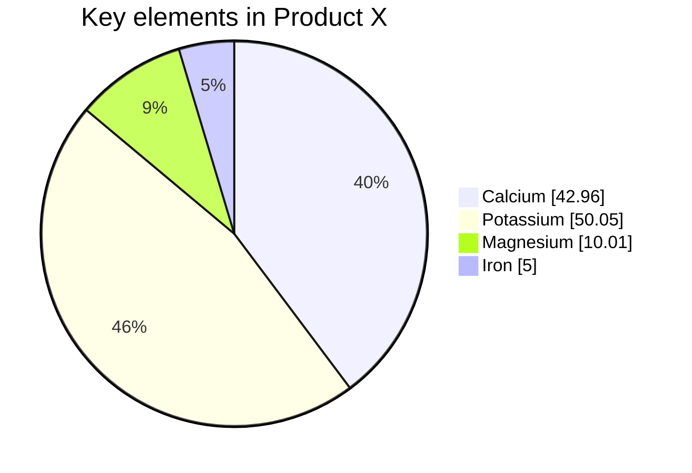

# Deckset Help

- [Getting Started](https://docs.deckset.com/English.lproj/getting-started.html)
- Formatting
  - [Headings](https://docs.deckset.com/English.lproj/Formatting/01-headings.html)
  - [Lists](https://docs.deckset.com/English.lproj/Formatting/02-lists.html)
  - [Text Styles](https://docs.deckset.com/English.lproj/Formatting/03-text-styles.html)
  - [Quotes](https://docs.deckset.com/English.lproj/Formatting/04-quotes.html)
  - [Links](https://docs.deckset.com/English.lproj/Formatting/05-links.html)
  - [Code Blocks](https://docs.deckset.com/English.lproj/Formatting/06-code-blocks.html)
  - [Tables](https://docs.deckset.com/English.lproj/Formatting/07-tables.html)
  - [Formulas](https://docs.deckset.com/English.lproj/Formatting/08-formulas.html)
  - [Emojis](https://docs.deckset.com/English.lproj/Formatting/09-emojis.html)
  - [Footers and Slide Numbers](https://docs.deckset.com/English.lproj/Formatting/10-footers-and-slide-numbers.html)
  - [Footnotes](https://docs.deckset.com/English.lproj/Formatting/11-footnotes.html)
  - [Controlling Line Breaks](https://docs.deckset.com/English.lproj/Formatting/12-controlling-line-breaks.html)
  - [Auto-Scaling](https://docs.deckset.com/English.lproj/Formatting/13-auto-scaling.html)
  - [Columns](https://docs.deckset.com/English.lproj/Formatting/14-columns.html)
- Media
  - [Background Images](https://docs.deckset.com/English.lproj/Media/01-background-images.html)
  - [Inline Images](https://docs.deckset.com/English.lproj/Media/02-inline-images.html)
  - [Videos](https://docs.deckset.com/English.lproj/Media/03-videos.html)
  - [Audio](https://docs.deckset.com/English.lproj/Media/04-audio.html)
  - [Markdown Graphs](https://docs.deckset.com/English.lproj/Media/05-mermaid.html)
- Customization
  - [Configuration commands](https://docs.deckset.com/English.lproj/Customization/01-configuration-commands.html)
  - [Custom theming](https://docs.deckset.com/English.lproj/Customization/02-custom-theming.html)
- Presenting
  - [Presenter Notes](https://docs.deckset.com/English.lproj/Presenting/presenter-notes.html)
  - [Build Steps](https://docs.deckset.com/English.lproj/Presenting/build-steps.html)
  - [Transitions](https://docs.deckset.com/English.lproj/Presenting/transitions.html)
  - [Hide Slides](https://docs.deckset.com/English.lproj/Presenting/hide-slides.html)
  - [Switch Presenter Display](https://docs.deckset.com/English.lproj/Presenting/presenter-display.html)
- [Keyboard Shortcuts](https://docs.deckset.com/English.lproj/02-keyboard-shortcuts.html)
- [Frequently Asked Questions](https://docs.deckset.com/English.lproj/faq.html)

# Getting Started

Deckset is a presentation software that creates great-looking slides from simple Markdown files.

### What is Markdown? [\#](https://docs.deckset.com/English.lproj/getting-started.html#what-is-markdown "Link to What is Markdown?")

Markdown is a simple syntax to format plain text. It allows you to create structured documents with just a few modifiers. Here’s an example:

```
# Headline indicates a first level title.

## Subheader a second level title.
```

### Separating Slides [\#](https://docs.deckset.com/English.lproj/getting-started.html#separating-slides "Link to Separating Slides")

To start a new slide, simply put three dashes (`---`) on a single line, with an empty line above and below.


### Use Headings [\#](https://docs.deckset.com/English.lproj/getting-started.html#use-headings "Link to Use Headings")

```
# Use Headings

Combine headings with paragraph text and other elements like lists:

- It's super quick.
- It's super easy.
```


### Paragraphs [\#](https://docs.deckset.com/English.lproj/getting-started.html#paragraphs "Link to Paragraphs")

```
# Paragraphs

Use a blank line in between text to start a new paragraph.

You can include a paragraph break by leaving an empty line between the paragraphs.
Otherwise lines will follow on directly like this.
```


## Headings

```
# Large Heading
```


```
## Regular Heading
```


```
### Small Heading
```


```
#### Tiny Heading
```


```
## Combine Headings

### Of Different Sizes
```


```
# [fit] Make Headings Fit Onto

# [fit] The Slide
```


## Lists

```
# Unordered Lists

- Start each bullet point
- with a dash to create
- an unordered list
```


```
# Ordered Lists

1. Start each item with
1. a number followed by a dot
1. to create an ordered list
```


```
# Nested Lists

- You can create nested lists
    1. by indenting
    1. each item with
    1. 4 spaces
- It's that simple
```


## Text Styles

```
# Asterisk Emphasis

Use single asterisks around text to *emphasise it*.

Or use double asterisks for an **strong emphasis** style.
```


```
# Underscore Emphasis

Alternatively, you can also use underscores to emphasize:

Wrap text in single underscores to _emphasize it_. Or use double underscores for the alternative __strong emphasis style__.
```


```
# Combined Emphasis

Combining underscores with asterisks lets us mix and match the emphasis styles. Play with it — some themes have additional style options for those combinations:

- _**Style 1**_
- __*Style 2*__
- __**Style 3**__
```


```
# The same *styles* work in **headings**, too.
```


```
# More Styles

- ~~Strikethrough~~
- Super<sup>script</sup>
- Sub<sub>script</sub>
- `Inline code`
```


## Quotes

```
> The best way to predict the future is to invent it
-- Alan Kay
```


```
# Inline Quotes

You can also use a quote together with paragraph text or other elements on the slide:

> The best way to predict the future is to invent it
-- Alan Kay

Prefix the author of the quote with `--`, or leave it out if it's anonymous.
```


## Links

```
# Link to External Resources

In case you're looking for something, you could use [Google](http://google.com) or [Wikipedia](http://wikipedia.com).

Links will be clickable in exported PDFs as well!
```


```
# Links Between Slides

Define an anchor on the slide you want to link to using standard HTML syntax:

`<a name="link-target"/>`

Then you can link to this [slide](#link-target) easily.
```


## Code Blocks

### Syntax Highlighting [\#](https://docs.deckset.com/English.lproj/Formatting/06-code-blocks.html#syntax-highlighting "Link to Syntax Highlighting")

Use GitHub style fenced code blocks to specify the language.

````
```javascript
$.ajax({
url: "/api/getWeather",
data: {
    zipcode: 97201
},
success: function( data ) {
    $( "#weather-temp" ).html( "" + data + " degrees" );
}
});
```
````


### Highlight Lines of Code [\#](https://docs.deckset.com/English.lproj/Formatting/06-code-blocks.html#highlight-lines-of-code "Link to Highlight Lines of Code")

To put the focus on specific lines of your code block, use the following command:

````
[.code-highlight: 2]

```javascript
$.ajax({
url: "/api/getWeather",
data: {
    zipcode: 97201
},
success: function( data ) {
    $( "#weather-temp" ).html( "" + data + " degrees" );
}
});
```
````


You can also highlight a range of lines:

````
[.code-highlight: 2, 6-8]

```javascript
$.ajax({
url: "/api/getWeather",
data: {
    zipcode: 97201
},
success: function( data ) {
    $( "#weather-temp" ).html( "" + data + " degrees" );
}
});
```
````


### Step through Highlighted Lines of Code [\#](https://docs.deckset.com/English.lproj/Formatting/06-code-blocks.html#step-through-highlighted-lines-of-code "Link to Step through Highlighted Lines of Code")

When presenting, you can step through multiple highlights incrementally. Place as many `[.code-highlight]` commands above a code block in the order you would like the lines of code to be highlighted when presenting.

````
[.code-highlight: none]
[.code-highlight: 2]
[.code-highlight: 6-8]
[.code-highlight: all]

```javascript
$.ajax({
url: "/api/getWeather",
data: {
    zipcode: 97201
},
success: function( data ) {
    $( "#weather-temp" ).html( "" + data + " degrees" );
}
});
```
````

### Automatic Scaling [\#](https://docs.deckset.com/English.lproj/Formatting/06-code-blocks.html#automatic-scaling "Link to Automatic Scaling")

Don’t worry if your code is slightly too long. Deckset scales code blocks to fit automatically.

````
```ruby
def establish_connection(spec = nil)
spec     ||= DEFAULT_ENV.call.to_sym
resolver =   ConnectionAdapters::ConnectionSpecification::Resolver.new configurations
spec     =   resolver.spec(spec)

unless respond_to?(spec.adapter_method)
    raise AdapterNotFound, "database configuration specifies nonexistent #{spec.config[:adapter]} adapter"
end

remove_connection
connection_handler.establish_connection self, spec
end
```
````


### Inline `code` [\#](https://docs.deckset.com/English.lproj/Formatting/06-code-blocks.html#inline-code "Link to Inline code")

Use code within normal text by enclosing it in backticks.

For example: `func map<A, B>(x: A?, f: A -> B) -> B?`


### Code background [\#](https://docs.deckset.com/English.lproj/Formatting/06-code-blocks.html#code-background "Link to Code background")

You can enable custom code background by customising one of existing themes using customisation menu:


This feature is currently unavailable from Markdown level. But please let us know if you’d like it to be configurable from Markdown level as well!

## Tables

Cells are separated by pipes `|`.

Table headers are separated from the table body with a line of three dashes `---`.

```
| Header 1 | Header 2 | Header 3 |
| --- | --- | --- |
| Cell 1 | Cell 2 | Cell 3 |
| Cell 4 | Cell 5 | Cell 6 |
```


### Text Alignment [\#](https://docs.deckset.com/English.lproj/Formatting/07-tables.html#text-alignment "Link to Text Alignment")

With `:---:` and `---:` you can center or right align the cell content.

```
|   Header 1  |    Header 2   |   Header 3   |
| ----------- | :-----------: | -----------: |
| Cell        |    _Cell_     |    *Cell*    |
| Cell        |   **Cell**    |   __Cell__   |
```


## Formulas

Easily include mathematical formulas by enclosing TeX commands in `$$` delimiters. Deckset uses [MathJax](http://www.mathjax.org/) to translate TeX commands into beautiful vector graphics.

```
$$
\left( \sum_{k=1}^n a_k b_k \right)^2 \leq \left( \sum_{k=1}^n a_k^2 \right) \left( \sum_{k=1}^n b_k^2 \right)
$$
```


### Inline Formulas [\#](https://docs.deckset.com/English.lproj/Formatting/08-formulas.html#inline-formulas "Link to Inline Formulas")

You can also include Formulas in paragraph text. Deckset takes care of adjusting the font size and color to match the surrounding text, for example:

```
The slope $$a$$ of the line defined by the function $$f(x) = 2x$$ is $$a = 2$$.
```


### Formula Autoscaling [\#](https://docs.deckset.com/English.lproj/Formatting/08-formulas.html#formula-autoscaling "Link to Formula Autoscaling")

Don’t worry if your equations get really complex. Deckset will scale them down to fit onto the slide.

```
$$
1 +  \frac{q^2}{(1-q)}+\frac{q^6}{(1-q)(1-q^2)}+\cdots =
\prod_{j=0}^{\infty}\frac{1}{(1-q^{5j+2})(1-q^{5j+3})},
\quad\quad \text{for $|q|<1$}.
$$
```


## Emojis

Deckset supports Slack style emojis, e.g.: `:sunny: :umbrella: :sunflower: :cat: :smile:`

```
Deckset supports emojis! :umbrella: :sunflower: :cat: :smile: :thumbsup:
```


Please refer to this [Emoji Reference Markdown file](http://deckset-assets.s3.amazonaws.com/emoji-reference.md) to see which emoji are supported in Deckset. There are a few favourites that aren’t part of Unicode yet, so we cannot support them.

## Footers and Slide Numbers

To add a persistent footer to each slide of your presentation, insert the following command at the _top_ of your file:

`footer: Your footer goes here`

To add running slide numbers to each slide of your presentation, insert the following command at the _top_ of your file:

`slidenumbers: true`

When combining the two commands, please make sure that there are _no empty lines_ between the two.

```
footer: Your footer goes here
slidenumbers: true
```

You can use standard text styles such as emphasis in your footer text, just as you would in other places too.

`footer: Use *emphasis* and ~~other~~ text styles if you like`

If you want to disable footers or slide numbers on individual slides, you can do so by using [per slide commands](https://docs.deckset.com/English.lproj/Customization/01-configuration-commands.html).

## Footnotes

```
# Footnotes

Footnotes are a breeze, for example:

Most of the time, you should adhere to the APA citation style[^1].

Note that footnote references have to be *unique in the markdown file*. This means, that you can also reference footnotes from any slide, no matter where they are defined.

[^1]: For more details on the citation guidelines of the American Psychological Association check out their [website](https://www.library.cornell.edu/research/citation/apa).
```


```
# Named References

Instead of just numbers, you can also name your footnote references[^Wiles, 1995].

[^Wiles, 1995]: [Modular elliptic curves and Fermat's Last Theorem](http://math.stanford.edu/~lekheng/flt/wiles.pdf). Annals of Mathematics 141 (3): 443–551.
```


## Controlling Line Breaks

```
# Controlling Line Breaks

In paragraph text, Deckset respects when you start a
new
line.

This can come in handy in situations where you need more control over how text is broken up into multiple lines.
```


```
# Use `<br>` for<br>line<br>breaks

You can use the HTML tag `<br>` to insert line breaks in elements that cannot contain regular new lines, such as headings or footers.
```


## Auto-Scaling

```
# Auto-Scaling

At times you have to fit more content onto one slide than the default font sizes allow for.

Deckset comes with an option to auto-scale paragraph text, lists, and other body content down to fit onto the slide. To enable this behavior put

`autoscale: true`

on the first line of your markdown file.
```


## Columns

In order to layout your content in columns, use the `[.column]` command to start a new column.

```

[.column]

# The First column

[.column]

# Second column.
```

Column widths are automatically generated using the available space divided evenly by the number of columns specified.

You can add as many columns as you like, but the more you add, the smaller the available width will be.

Combine Columns with [Auto-Scaling](https://docs.decksetapp.com/English.lproj/Formatting/13-auto-scaling.html) to automatically scale down the text size to fit on the side.

# Media

## Background Images

### Full Background Image [\#](https://docs.deckset.com/English.lproj/Media/01-background-images.html#full-background-image "Link to Full Background Image")

```

```


### Fit Background Image [\#](https://docs.deckset.com/English.lproj/Media/01-background-images.html#fit-background-image "Link to Fit Background Image")

```

```


### Multiple Background Images [\#](https://docs.deckset.com/English.lproj/Media/01-background-images.html#multiple-background-images "Link to Multiple Background Images")

```


```


### Text on Images [\#](https://docs.deckset.com/English.lproj/Media/01-background-images.html#text-on-images "Link to Text on Images")

```


# Text on Images

Setting text on images applies a filter to the image to make the text more readable.
```


### Disable Filter [\#](https://docs.deckset.com/English.lproj/Media/01-background-images.html#disable-filter "Link to Disable Filter")

```


# Disable Filter
```


### Zoom In [\#](https://docs.deckset.com/English.lproj/Media/01-background-images.html#zoom-in "Link to Zoom In")

```


# Zoom In
```


### Split Slides [\#](https://docs.deckset.com/English.lproj/Media/01-background-images.html#split-slides "Link to Split Slides")

```


# Split Slides

Use the `left` or `right` modifiers to place the image in the left or right half of the slide, respectively.
```


### Force Apply Filter [\#](https://docs.deckset.com/English.lproj/Media/01-background-images.html#force-apply-filter "Link to Force Apply Filter")

```


# Force Apply Filter

Use the `filtered` keyword to apply the theme's filter to an image that isn't filtered by default.
```


### Split Slides [\#](https://docs.deckset.com/English.lproj/Media/01-background-images.html#split-slides-1 "Link to Split Slides")

```


# Split Slides

Combine `left` or `right` with the `fit` keyword or a percentage to adjust the image scaling.
```


### Alpha [\#](https://docs.deckset.com/English.lproj/Media/01-background-images.html#alpha "Link to Alpha")

Use `alpha` on image to specify its opacity.

```

```

### Global Background Image [\#](https://docs.deckset.com/English.lproj/Media/01-background-images.html#global-background-image "Link to Global Background Image")

To apply a background image to every slide in your presentation, simply add the `background-image` command at the very top of your Markdown file:

```
background-image: image2.jpg

(rest of your content)
```

## Inline Images

### Combine Text and Images [\#](https://docs.deckset.com/English.lproj/Media/02-inline-images.html#combine-text-and-images "Link to Combine Text and Images")

```

```


### Fill the Slide [\#](https://docs.deckset.com/English.lproj/Media/02-inline-images.html#fill-the-slide "Link to Fill the Slide")

```

```


### Custom Scaling [\#](https://docs.deckset.com/English.lproj/Media/02-inline-images.html#custom-scaling "Link to Custom Scaling")

```

```


### Image Grids [\#](https://docs.deckset.com/English.lproj/Media/02-inline-images.html#image-grids "Link to Image Grids")

```


```


### Corner Radius [\#](https://docs.deckset.com/English.lproj/Media/02-inline-images.html#corner-radius "Link to Corner Radius")


You can set corner radius of images using following md:

```

```

This currently only works for plain static images. Let us know if you’d like it to work for other media too.

## Videos

```

```


```
# Inline Videos


```


```
# YouTube Embeds!


You can also use URL parameters like `?t=30s` to specify a start time for the clip.
```


```


# Video Layout Control

Use the same layout modifiers as with images to control the positioning of videos.

- `left` and `right`
- `fit` and `fill`
- Percentage sizing, e.g. `50%`
- `hide` to hide the video. Audio will play regardless.
```


```

```

## Video Playback Control

Control video playback by using one of those directives:

- `autoplay`
- `loop`
- `mute`

```

```

## Automatic slide advancement

You can annotate a video to have it automatically advance to the next slide once it finishes playback.

```

```

Note: this only works for the last video on the slide and there must be no build lists on that slide.

## Audio

To add audio files to your presentation, add them to your Markdown like so:

```

```

Your operating system’s file type icon will be used as a visual representation of the audio file.

### Audio Layout Control [\#](https://docs.deckset.com/English.lproj/Media/04-audio.html#audio-layout-control "Link to Audio Layout Control")

Use the same layout modifiers as with images to control the positioning of audio file icons.

- `left` and `right`
- `fit` and `fill`
- Percentage sizing, e.g. `25%`
- `hide` to hide the visual representation. Audio will play regardless.

### Audio Playback Control [\#](https://docs.deckset.com/English.lproj/Media/04-audio.html#audio-playback-control "Link to Audio Playback Control")

Control audio playback by using one of those directives:

- `autoplay`
- `loop`
- `mute`

## Markdown Graphs

You can add graphs to your presentation by leveraging code blocks and specifying mermaid as the desired language:

````

````

You can also use customization menu to specify base colors for Mermaid graphs:


You can learn more about available graphs in [mermaid.js documentation](https://mermaid.js.org/intro/). Please note that Zenmul diagrams are currently not supported. If this is something you’d like us to add please let us know via support email!

# Customization

## Configuration commands

Use commands to configure your presentation settings. Commands can either be applied _globally_ — if put at the top of your Markdown file — or _per slide_ to set or override global settings. When using global configuration commands, make sure that there are _no line breaks_ between any other commands at the top of your markdown file.

### Scale content to fit the slide [\#](https://docs.deckset.com/English.lproj/Customization/01-configuration-commands.html#scale-content-to-fit-the-slide "Link to Scale content to fit the slide")

At times you have to fit more content onto one slide than the default font sizes allow for.

Deckset comes with an option to auto-scale paragraph text, lists, and other body content down to fit onto the slide. To enable this behavior put the `autoscale: true` command at the top of your markdown file.

You may turn this on or off on an individual slide by declaring `[.autoscale: true]` or `[.autoscale: false]` on the respective slide.

### Build lists [\#](https://docs.deckset.com/English.lproj/Customization/01-configuration-commands.html#build-lists "Link to Build lists")

In Presenter and Rehearsal mode, you may want list items to appear one by one. To achieve this with Deckset, use the `build-lists: true` command.

Please note that this only affects Presenter (and Rehearsal) mode.

You may turn this on or off on an individual slide by declaring `[.build-lists: true]` or `[.build-lists: false]` on the respective slide.

### Slide numbers [\#](https://docs.deckset.com/English.lproj/Customization/01-configuration-commands.html#slide-numbers "Link to Slide numbers")

To add running slide numbers to your presentation use the `slidenumbers: true` command.

You may turn this on or off on an individual slide by declaring `[.slidenumbers: true]` or `[.slidenumbers: false]` on the respective slide.

To add the count of slides in your presentation, use the `slidecount: true` command. You may also turn this off on an individual slide by declaring `[.slidecount: true]` or `[.slidecount: false]` on the respective slide.

### Footers [\#](https://docs.deckset.com/English.lproj/Customization/01-configuration-commands.html#footers "Link to Footers")

To add a persistent footer to each slide of your presentation, use the `footer: My Footer content` command.

To override your global footer or to add a footer to a single slide, add `[.footer: A different footer]` to the respective slide.

You may turn off the footer on an individual slide by declaring `[.hide-footer]` on the respective slide.

### Slide transitions [\#](https://docs.deckset.com/English.lproj/Customization/01-configuration-commands.html#slide-transitions "Link to Slide transitions")

In Presenter mode, you may want to transition between slides. To achieve this with Deckset, use the `slide-transition: true` command.

You can control the duration of the transition by passing in the value in seconds: `slide-transition: fade(0.3)`.

You may also use this command on a single slide, like so: `[.slide-transition: fade(0.3)]` or `[.slide-transition: false]`.

### Use headers as slide dividers [\#](https://docs.deckset.com/English.lproj/Customization/01-configuration-commands.html#use-headers-as-slide-dividers "Link to Use headers as slide dividers")

To automatically start a new slide with each header, use the `slide-dividers: #, ##, ###, ####` command and specify the header levels you would like to take into account.

Please note that this command can only be used globally, at the top of your Markdown file.

### Default code language [\#](https://docs.deckset.com/English.lproj/Customization/01-configuration-commands.html#default-code-language "Link to Default code language")

You can specify a default code language by adding it at the top of your Markdown file:

```
code-language: Swift
```

### Store theme choice in document [\#](https://docs.deckset.com/English.lproj/Customization/01-configuration-commands.html#store-theme-choice-in-document "Link to Store theme choice in document")

Deckset does store the theme choice as metadata to the file. In some cases, this information can get lost, e.g. in version control systems or when sending the file via email.

To make sure the theme choice doesn’t get lost, you can use the following command, referencing any theme by its name: `theme: Fira`.

If you also want to specify the color choice, you can reference the number of the color swatch as it appears within Deckset e.g.:

`theme: Fira, 3`

Please note that this command can only be used globally, at the top of your Markdown file.

### Automatically fit headers [\#](https://docs.deckset.com/English.lproj/Customization/01-configuration-commands.html#automatically-fit-headers "Link to Automatically fit headers")

Deckset allows you to fit header to entire slide to get that signature font look. However repeating this for every slide might be a bit cumbersome. You can address that by using the `fit-header` command like so:

```
fit-header: #, ##
```

Note that this only works as a global command and needs to be placed on top of your md file.

### Global Background Image [\#](https://docs.deckset.com/English.lproj/Customization/01-configuration-commands.html#global-background-image "Link to Global Background Image")

To apply a background image to every slide in your presentation, simply add the `background-image` command at the very top of your Markdown file:

```
background-image: image2.jpg

(rest of your content)
```

## Custom theming

Deckset 2.0 introduces customization options for slide styles directly within the user interface. In addition to these UI-based controls, you can apply fine-grained styling to individual slides using the customization commands outlined below. Note that command-based styles will always override any styles set in the UI.

### Text and Headers [\#](https://docs.deckset.com/English.lproj/Customization/02-custom-theming.html#text-and-headers "Link to Text and Headers")

To customize the look and feel of your text and headers, you may add customization commands to `text`, `text-emphasis`, `text-strong`, `header`, `header-emphasis`, `header-strong`, `slidenumber-style` and `footer-style` with the desired color, alignment, line-height, text-scale, font and capitalization.

```
[.text: #000000, alignment(left|center|right), line-height(10), text-scale(2.0), kern(1), Avenir Next Regular]
[.header: #FF0000, alignment(left|center|right), line-height(18), text-scale(3.0), Avenir Next Bold, capitalization(default|upper|title)]
[.footer-style: #2F2F2F, alignment(left|center|right), line-height(8), text-scale(1.5), Avenir Next Regular]
```

We recommend using Mac’s native Font Book application to search for fonts.

### Background color [\#](https://docs.deckset.com/English.lproj/Customization/02-custom-theming.html#background-color "Link to Background color")

To customize the background color of your slide, you may use the following customization command:

```
[.background-color: #FF0000]
```

### Lists [\#](https://docs.deckset.com/English.lproj/Customization/02-custom-theming.html#lists "Link to Lists")

To customize your list styles, you may add customization commands for the list color, bullet-character, alignment and ordered and unordered bullet indent.

```
[.list: #000000, bullet-character(Custom String), alignment(left|center|right), bullet-indent(40), ordered-bullet-indent(20)]
```

### Tables [\#](https://docs.deckset.com/English.lproj/Customization/02-custom-theming.html#tables "Link to Tables")

To customize the style of your tables, you may use the following commands:

```
[.table-separator: #000000, stroke-width(10)]
[.table: margin(5)]
```

### Code [\#](https://docs.deckset.com/English.lproj/Customization/02-custom-theming.html#code "Link to Code")

Deckset automatically picks a random set of colors with high enough contrast against the chosen background color for your code. You may add customization commands for the line-height and font family.

For consistent styles between code blocks and to prevent palette regeneration, use seed number `42` for persistence.

```
[.code: auto(42), Font Family Name, line-height(4.2)]
```

You can also control alpha code build-in by specifying following command:

```
[.code: dimmed-opacity(0.2)]
```

### Footnotes [\#](https://docs.deckset.com/English.lproj/Customization/02-custom-theming.html#footnotes "Link to Footnotes")

To customize the look and feel of footnotes, you may use the following commands:

```
[.footnote: #000000, alignment(left|center|right), line-height(10), text-scale(2.0), Avenir Next Regular]
```

Style the horizontal ruler that separates the footnote from the slide content like so:

```
[.footnote-separator: #001100, height(10), margin(12)]
```

### Formulas [\#](https://docs.deckset.com/English.lproj/Customization/02-custom-theming.html#formulas "Link to Formulas")

To customize the style of formulas, you may use the following command:

```
[.formula: text-scale(42), alignment(center), #ff0011]
```

### Quotes [\#](https://docs.deckset.com/English.lproj/Customization/02-custom-theming.html#quotes "Link to Quotes")

To customize the style of quotes, you may use the following commands:

```
[.quote: #000000, alignment(left|center|right), line-height(10), text-scale(2.0), Avenir Next Regular]
```

To customize the style of the quote’s author, use:

```
[.quote-author: #000000, alignment(left|center|right), line-height(10), text-scale(2.0), Avenir Next Regular]
```

### Graphs [\#](https://docs.deckset.com/English.lproj/Customization/02-custom-theming.html#graphs "Link to Graphs")

To customise style of Mermaid Graphs, you may use the following command:

```
[.graph: #ffffff, #aaffff, #000000, dark-mode(false)]
```

### Store theme choice in document [\#](https://docs.deckset.com/English.lproj/Customization/02-custom-theming.html#store-theme-choice-in-document "Link to Store theme choice in document")

Deckset does store the theme choice as metadata to the file. In some cases, this information can get lost, e.g. in version control systems or when sending the file via email.

To make sure the theme choice doesn’t get lost, you can use the following command `theme: Fira`.

If you also want to specify the color choice, you can reference the number of the color swatch as it appears within Deckset e.g.:

`theme: Fira, 3`

Please note that this command can only be used globally, at the top of your Markdown file.

# Presenting

## Presenter Notes

### Using presenter notes [\#](https://docs.deckset.com/English.lproj/Presenting/presenter-notes.html#using-presenter-notes "Link to Using presenter notes")

Deckset turns every paragraph that starts with a `^` into presenter notes and doesn’t show this text on the slides.

You’ll see these notes on the presenter display (with two screens connected) or by using the rehearsal mode.

To preview your presenter notes in the main application window, you can turn them on by selecting `Toggle Presenter Notes` from the `View` menu.

To start another presenter note paragraph, prefix it with a caret again. Deckset will automatically scale the notes down to fit onto the presenter display in case you have a lot of text.

Example:

```
# My slide title

^ This is a presenter note.
```


### Customize the display of presenter notes [\#](https://docs.deckset.com/English.lproj/Presenting/presenter-notes.html#customize-the-display-of-presenter-notes "Link to Customize the display of presenter notes")

To customize the style of presenter notes, in both Presenter and Rehearsal modes and in exported documents, you may use the `presenter-notes` command like so:

`presenter-notes: text-scale(2), alignment(left|right|center), Helvetica`

You may also use this command on a single slide, like so:

`[.presenter-notes: text-scale(2), alignment(left|right|center), Helvetica]`

## Build Steps

When presenting you often want list bullet points to appear one by one. To achieve this with Deckset, put

`build-lists: true`

at the top of your file.

If you want to disable this setting on individual slides, you can do so by using [per slide commands](https://docs.deckset.com/English.lproj/Customization/01-configuration-commands.html).

## Transitions

### Enabling transitions [\#](https://docs.deckset.com/English.lproj/Presenting/transitions.html#enabling-transitions "Link to Enabling transitions")

When presenting, you may want to transition between slides. To achieve this with Deckset, use the `slide-transition: true` command.

### Transition styles [\#](https://docs.deckset.com/English.lproj/Presenting/transitions.html#transition-styles "Link to Transition styles")

The following transition styles are available:

- `fade` — fades between slide (default)
- `fadeThroughColor(#000000)` — fades through a color, into the next slide. The color is passed as hex value in parentheses.
- `push(horizontal|vertical|top|right|bottom|left)` — the next slide pushes the previous out of the viewport. Supports the use of `horizontal` and `vertical` parameters, which pushes slides from the right (or top respectively) when going forward and left (or bottom respectively) when going backwards in the presentation.
- `move(horizontal|vertical|top|right|bottom|left)` — the next slide moves over the top of the previous slide. Supports the use of `horizontal` and `vertical` parameters, which moves slides from the right (or top respectively) when going forward and left (or bottom respectively) when going backwards in the presentation.
- `reveal(horizontal|vertical|top|right|bottom|left)` — the next slide is revealed by moving the previous slide out of the viewport. Supports the use of `horizontal` and `vertical` parameters, which reveals slides from the right (or top respectively) when going forward and left (or bottom respectively) when going backwards in the presentation.

### Transition timing [\#](https://docs.deckset.com/English.lproj/Presenting/transitions.html#transition-timing "Link to Transition timing")

You can control the duration of the transition by passing in the value in seconds: `slide-transition: fade(0.3)`.

### Transitions on individual slides [\#](https://docs.deckset.com/English.lproj/Presenting/transitions.html#transitions-on-individual-slides "Link to Transitions on individual slides")

You may also use the transition command on a single slide, like so: `[.slide-transition: push(horizontal, 0.3)]` or `[.slide-transition: false]`.

## Hide Slides

If you want to prevent particular slides (or pieces of content) from being presented but want to keep them in your document, you can do it like this:

```
<!--

  This slide will be hidden.

-->
```

# Frequently Asked Questions

## Do I need to know how to code? [\#](https://docs.deckset.com/English.lproj/faq.html#do-i-need-to-know-how-to-code "Link to Do I need to know how to code?")

No, you definitely don’t need to be a coder. Markdown is a very simple way of formatting text, which is used by millions of people without knowing how to code. We think you’ll be able to jump straight in, but if you want to familiarise yourself a little bit more and have ten minutes to spare, [here’s a great intro to Markdown](http://markdowntutorial.com/).

## Can I tweak or re-order my slides in Deckset? [\#](https://docs.deckset.com/English.lproj/faq.html#can-i-tweak-or-re-order-my-slides-in-deckset "Link to Can I tweak or re-order my slides in Deckset?")

No. Deckset formats and presents your files. You can easily alter them in your Markdown file. You work directly in text. Deckset does the rest for you.

## Why does Deckset for macOS not have a built-in editor? [\#](https://docs.deckset.com/English.lproj/faq.html#why-does-deckset-for-macos-not-have-a-built-in-editor "Link to Why does Deckset for macOS not have a built-in editor?")

It doesn’t need one — there are plenty of great text editors out there, and everybody has their favourite anyway. We want you to be able to work with what you’re used to and what you enjoy the most.

## What editors work well with Deckset? [\#](https://docs.deckset.com/English.lproj/faq.html#what-editors-work-well-with-deckset "Link to What editors work well with Deckset?")

We personally use Atom, Sublime Text, TextMate, Chocolat, Mou and Writer Pro. Those are great. But others are great too. You can choose whatever editor you like. All you need is a Markdown text file.

## Can Deckset highlight my code? [\#](https://docs.deckset.com/English.lproj/faq.html#can-deckset-highlight-my-code "Link to Can Deckset highlight my code?")

Yes! Simply wrap your code in three backticks (\`\`\`). To add syntax highlighting, just add an optional language identifier. For example, to syntax-highlight Javascript code:

```
function myFunction(){
    alert(“Hello World!”)
};
```

See [here](https://github.com/isagalaev/highlight.js/tree/master/src/languages) for a complete list of all languages that are supported.

## What’s the best way to work with images in Deckset? [\#](https://docs.deckset.com/English.lproj/faq.html#whats-the-best-way-to-work-with-images-in-deckset "Link to What’s the best way to work with images in Deckset?")

We recommend you use web images in your presentations. You can simply paste the image’s URL into the standard Markdown syntax, or even easier, drag the image from the web onto the Deckset window. The Markdown is automatically created and copied to your clipboard.

Images from the web will be downloaded to your computer and cached locally, so you don’t have to worry about having an Internet connection when you present.

Using web images comes with one big advantage — you can easily share your files (your deck!) with other people, without having to worry about sending them the images as well.

Tools like Dropbox or other storage services are easy ways to bring your local images to the web and guarantee a smooth workflow with Deckset.

Want to find out more about how to work with images in Deckset? Please refer to the “Working with Images” example presentation within Deckset.
